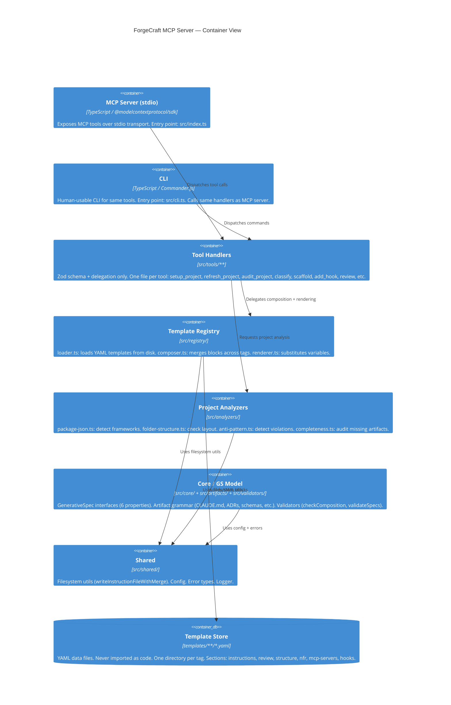

# C4 Container Diagram — ForgeCraft

```mermaid
C4Container
    title ForgeCraft MCP Server — Container View

    Container(mcp_server, "MCP Server (stdio)", "TypeScript / @modelcontextprotocol/sdk", "Exposes MCP tools over stdio transport. Entry point: src/index.ts")
    Container(cli, "CLI", "TypeScript / Commander.js", "Human-usable CLI for same tools. Entry point: src/cli.ts. Calls same handlers as MCP server.")

    Container(tool_handlers, "Tool Handlers", "src/tools/**", "Zod schema + delegation only. One file per tool: setup_project, refresh_project, audit_project, classify, scaffold, add_hook, review, etc.")

    Container(registry, "Template Registry", "src/registry/", "loader.ts: loads YAML templates from disk. composer.ts: merges blocks across tags. renderer.ts: substitutes variables.")

    Container(analyzers, "Project Analyzers", "src/analyzers/", "package-json.ts: detect frameworks. folder-structure.ts: check layout. anti-pattern.ts: detect violations. completeness.ts: audit missing artifacts.")

    Container(core, "Core / GS Model", "src/core/ + src/artifacts/ + src/validators/", "GenerativeSpec interfaces (6 properties). Artifact grammar (CLAUDE.md, ADRs, schemas, etc.). Validators (checkComposition, validateSpecs).")

    Container(shared, "Shared", "src/shared/", "Filesystem utils (writeInstructionFileWithMerge). Config. Error types. Logger.")

    ContainerDb(templates, "Template Store", "templates/**/*.yaml", "YAML data files. Never imported as code. One directory per tag. Sections: instructions, review, structure, nfr, mcp-servers, hooks.")

    Rel(mcp_server, tool_handlers, "Dispatches tool calls")
    Rel(cli, tool_handlers, "Dispatches commands")
    Rel(tool_handlers, registry, "Delegates composition + rendering")
    Rel(tool_handlers, analyzers, "Requests project analysis")
    Rel(registry, templates, "Loads YAML blocks")
    Rel(registry, shared, "Uses filesystem utils")
    Rel(analyzers, shared, "Uses filesystem utils")
    Rel(core, shared, "Uses config + errors")
```
