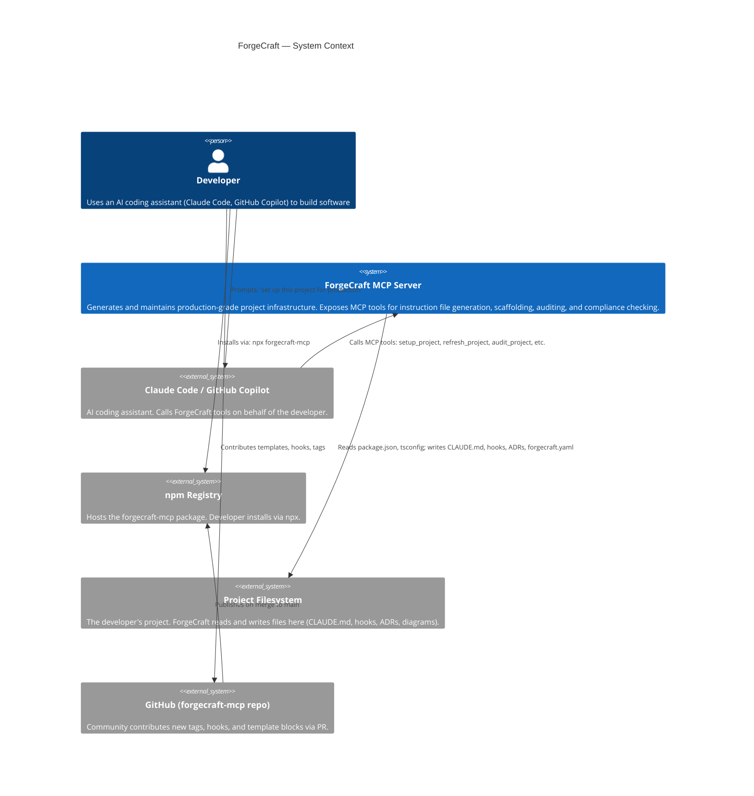

# C4 Context Diagram — ForgeCraft

```mermaid
C4Context
    title ForgeCraft — System Context

    Person(developer, "Developer", "Uses an AI coding assistant (Claude Code, GitHub Copilot) to build software")

    System(forgecraft, "ForgeCraft MCP Server", "Generates and maintains production-grade project infrastructure. Exposes MCP tools for instruction file generation, scaffolding, auditing, and compliance checking.")

    System_Ext(claude, "Claude Code / GitHub Copilot", "AI coding assistant. Calls ForgeCraft tools on behalf of the developer.")
    System_Ext(npm, "npm Registry", "Hosts the forgecraft-mcp package. Developer installs via npx.")
    System_Ext(filesystem, "Project Filesystem", "The developer's project. ForgeCraft reads and writes files here (CLAUDE.md, hooks, ADRs, diagrams).")
    System_Ext(github, "GitHub (forgecraft-mcp repo)", "Community contributes new tags, hooks, and template blocks via PR.")

    Rel(developer, claude, "Prompts: 'set up this project for production'")
    Rel(claude, forgecraft, "Calls MCP tools: setup_project, refresh_project, audit_project, etc.")
    Rel(forgecraft, filesystem, "Reads package.json, tsconfig; writes CLAUDE.md, hooks, ADRs, forgecraft.yaml")
    Rel(developer, npm, "Installs via: npx forgecraft-mcp")
    Rel(github, npm, "Publishes on merge to main")
    Rel(developer, github, "Contributes templates, hooks, tags")
```
