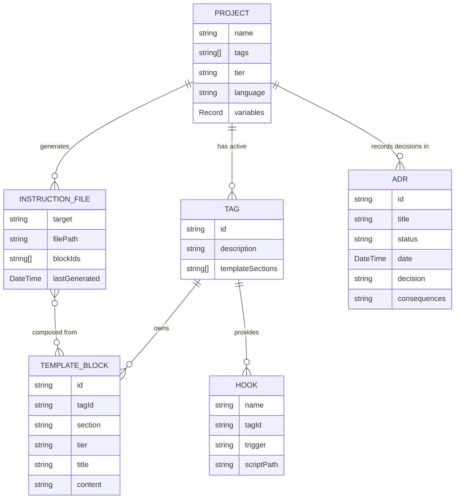

# Domain Model — ForgeCraft

```mermaid
erDiagram
    PROJECT {
        string name
        string[] tags
        string tier
        string language
        Record variables
    }

    TAG {
        string id
        string description
        string[] templateSections
    }

    TEMPLATE_BLOCK {
        string id
        string tagId
        string section
        string tier
        string title
        string content
    }

    HOOK {
        string name
        string tagId
        string trigger
        string scriptPath
    }

    INSTRUCTION_FILE {
        string target
        string filePath
        string[] blockIds
        DateTime lastGenerated
    }

    ADR {
        string id
        string title
        string status
        DateTime date
        string decision
        string consequences
    }

    PROJECT ||--o{ TAG : "has active"
    TAG ||--o{ TEMPLATE_BLOCK : "owns"
    TAG ||--o{ HOOK : "provides"
    PROJECT ||--o{ INSTRUCTION_FILE : "generates"
    INSTRUCTION_FILE }o--o{ TEMPLATE_BLOCK : "composed from"
    PROJECT ||--o{ ADR : "records decisions in"
```
