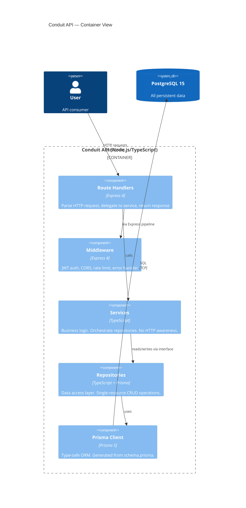

# C4 Container Diagram — Conduit API

## Layer Rules (enforced by CLAUDE.md)

- Routes → Services only (never Routes → Repos, never Routes → Prisma)
- Services → Repositories via interface (never Services → Prisma directly)
- Dependencies flow downward only
- Prisma Client is private to the Repository layer
