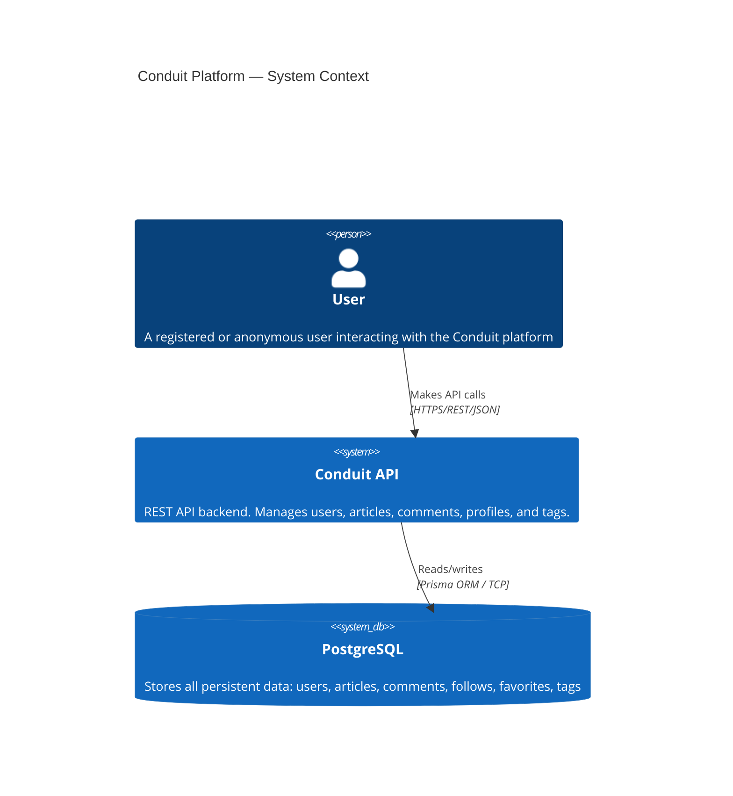

# C4 Context Diagram — Conduit API

## Key Observations

- The Conduit API is the single entry point for all client interactions
- No external service dependencies (email, storage, CDN) in this scope
- PostgreSQL is the single persistence boundary — all data lives here
- Authentication is stateless JWT — no external session store
