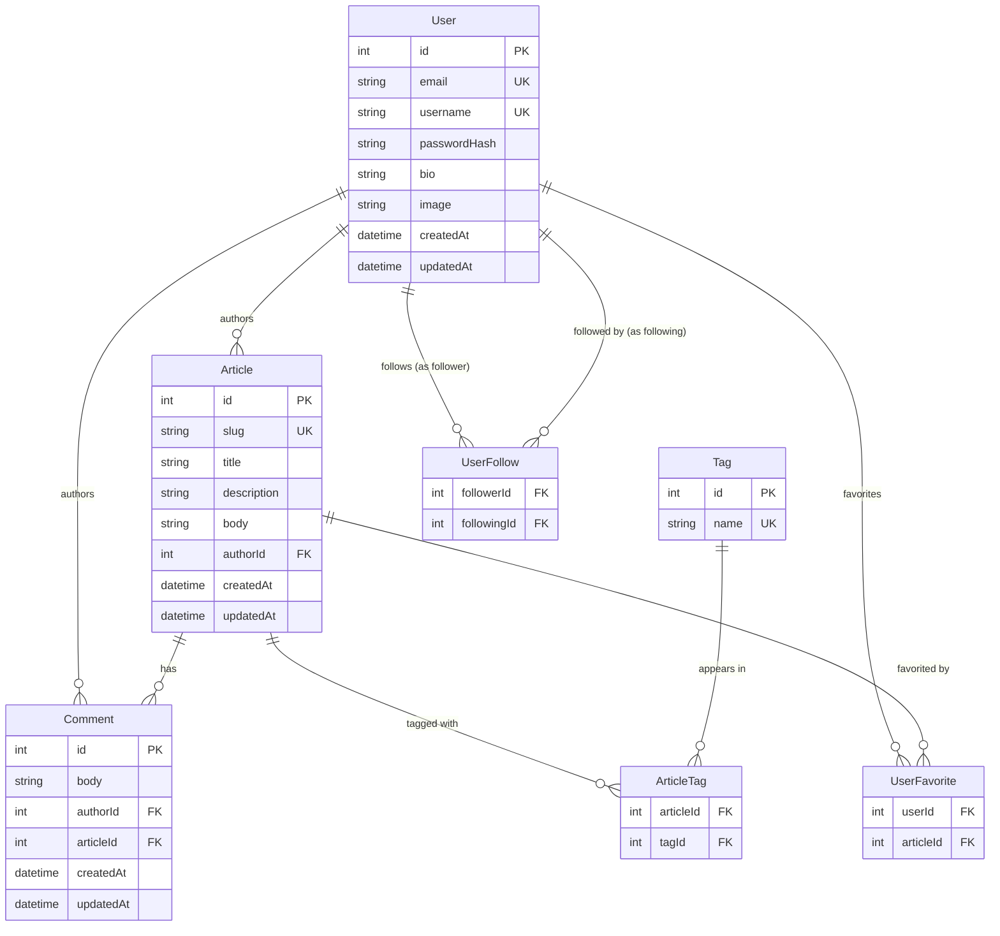

# Domain Model — Conduit

## Key Constraints

- `User.email` and `User.username` are unique
- `Article.slug` is unique and derived from title (lowercased, hyphenated)
- `UserFollow` is a self-referential M:M on User (follower → following)
- `UserFavorite` is M:M between User and Article
- `ArticleTag` is M:M between Article and Tag
