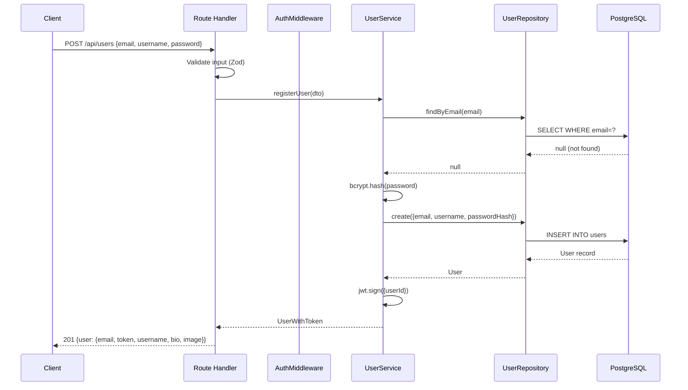
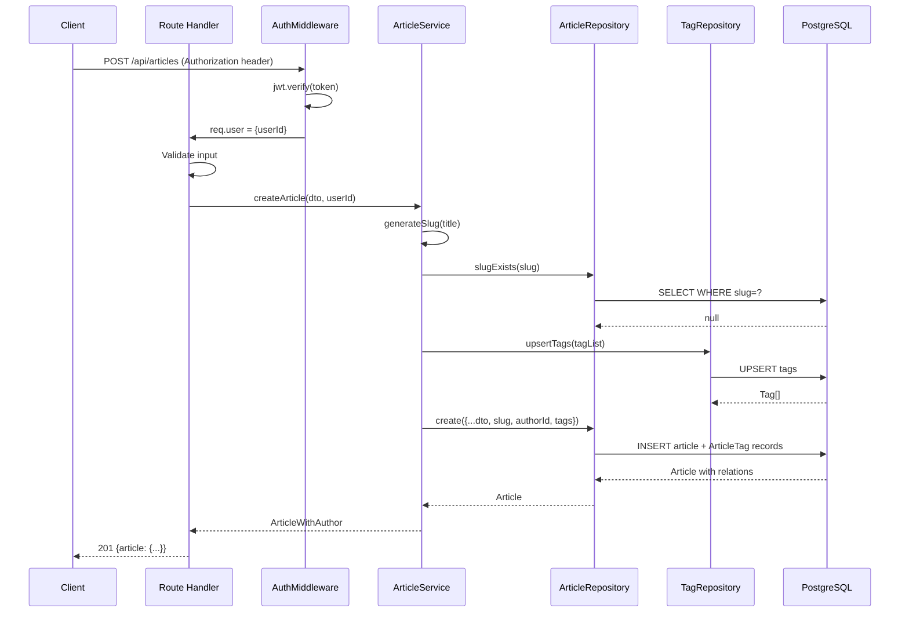
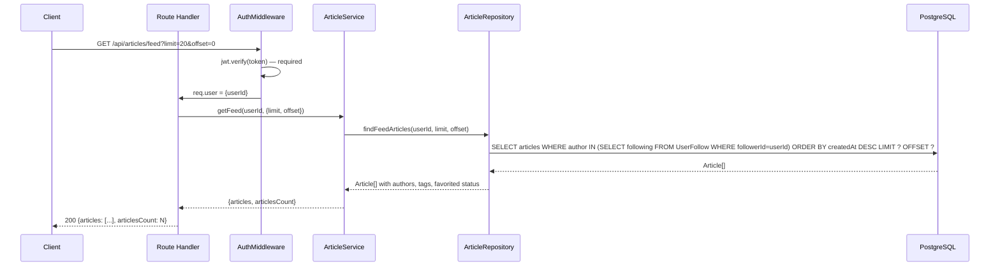

# Sequence Diagrams — Conduit API

## 1. User Registration

```mermaid
sequenceDiagram
  participant C as Client
  participant R as Route Handler
  participant M as AuthMiddleware
  participant S as UserService
  participant Repo as UserRepository
  participant DB as PostgreSQL

  C->>R: POST /api/users {email, username, password}
  R->>R: Validate input (Zod)
  R->>S: registerUser(dto)
  S->>Repo: findByEmail(email)
  Repo->>DB: SELECT WHERE email=?
  DB-->>Repo: null (not found)
  Repo-->>S: null
  S->>S: bcrypt.hash(password)
  S->>Repo: create({email, username, passwordHash})
  Repo->>DB: INSERT INTO users
  DB-->>Repo: User record
  Repo-->>S: User
  S->>S: jwt.sign({userId})
  S-->>R: UserWithToken
  R-->>C: 201 {user: {email, token, username, bio, image}}
```

## 2. Create Article

```mermaid
sequenceDiagram
  participant C as Client
  participant R as Route Handler
  participant M as AuthMiddleware
  participant S as ArticleService
  participant AR as ArticleRepository
  participant TR as TagRepository
  participant DB as PostgreSQL

  C->>M: POST /api/articles (Authorization header)
  M->>M: jwt.verify(token)
  M->>R: req.user = {userId}
  R->>R: Validate input
  R->>S: createArticle(dto, userId)
  S->>S: generateSlug(title)
  S->>AR: slugExists(slug)
  AR->>DB: SELECT WHERE slug=?
  DB-->>AR: null
  S->>TR: upsertTags(tagList)
  TR->>DB: UPSERT tags
  DB-->>TR: Tag[]
  S->>AR: create({...dto, slug, authorId, tags})
  AR->>DB: INSERT article + ArticleTag records
  DB-->>AR: Article with relations
  AR-->>S: Article
  S-->>R: ArticleWithAuthor
  R-->>C: 201 {article: {...}}
```

## 3. Get Feed

```mermaid
sequenceDiagram
  participant C as Client
  participant R as Route Handler
  participant M as AuthMiddleware
  participant S as ArticleService
  participant AR as ArticleRepository
  participant DB as PostgreSQL

  C->>M: GET /api/articles/feed?limit=20&offset=0
  M->>M: jwt.verify(token) — required
  M->>R: req.user = {userId}
  R->>S: getFeed(userId, {limit, offset})
  S->>AR: findFeedArticles(userId, limit, offset)
  AR->>DB: SELECT articles WHERE author IN (SELECT following FROM UserFollow WHERE followerId=userId) ORDER BY createdAt DESC LIMIT ? OFFSET ?
  DB-->>AR: Article[]
  AR-->>S: Article[] with authors, tags, favorited status
  S-->>R: {articles, articlesCount}
  R-->>C: 200 {articles: [...], articlesCount: N}
```
