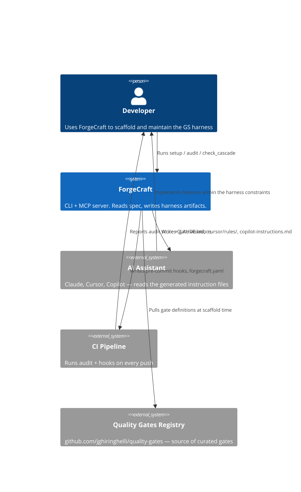

# Tech Spec: ForgeCraft MCP — Generative Specification Framework

## Overview

ForgeCraft is a TypeScript CLI + MCP server that scaffolds Generative Specification harnesses for AI-assisted software projects. It reads a project directory and a functional spec, infers stack tags, and writes instruction files (CLAUDE.md, .cursor/rules/, .github/copilot-instructions.md, etc.), pre-commit hooks, doc stubs, and `forgecraft.yaml`. It has no runtime footprint — it writes files and exits. The MCP sentinel is the only persistent surface, and it is intentionally minimal (~200 tokens).

Architecture is a layered CLI/MCP dispatch → stateless tool handlers → template registry pattern. All state lives in the file system. No database. No external service at runtime.

## Architecture

### Layer Diagram

```
┌─────────────────────────────────────────────────────┐
│  Entry Points                                        │
│  ├── index.ts (MCP server — stdio transport)         │
│  └── cli.ts   (CLI — process.argv)                  │
└────────────────────┬────────────────────────────────┘
                     │
┌────────────────────▼────────────────────────────────┐
│  Dispatch Layer                                      │
│  └── tools/forgecraft-dispatch.ts                   │
│      Routes action name → tool handler               │
└────────────────────┬────────────────────────────────┘
                     │
┌────────────────────▼────────────────────────────────┐
│  Tool Handlers  (src/tools/)                         │
│  ├── setup-project.ts     ← phase 1 + 2 orchestrator│
│  ├── setup-phase1.ts      ← analysis + questions     │
│  ├── setup-phase2.ts      ← file generation          │
│  ├── setup-artifact-writers.ts ← doc stubs          │
│  ├── audit.ts             ← 0-100 compliance score  │
│  ├── check-cascade-steps.ts ← 5-step cascade        │
│  ├── generate-harness.ts  ← L2 probe scaffolding    │
│  ├── layer-status.ts      ← L1-L4 tracker           │
│  ├── propose-session.ts   ← pre-impl estimation     │
│  ├── generate-session-prompt.ts                     │
│  ├── close-cycle.ts       ← end-of-cycle gate       │
│  ├── change-request.ts    ← ADR + EDR generation    │
│  ├── generate-decision.ts ← decision records        │
│  ├── extract-adrs-history.ts ← brownfield ADR pull  │
│  └── ... (21 total actions)                         │
└────────────────────┬────────────────────────────────┘
                     │
┌────────────────────▼────────────────────────────────┐
│  Registry Layer  (src/registry/)                     │
│  ├── sentinel-renderer.ts ← CLAUDE.md + targets     │
│  ├── loader-tag.ts        ← YAML template loader    │
│  ├── mcp-discovery.ts     ← MCP server recommender  │
│  └── scaffold-writer.ts   ← file structure writer   │
└────────────────────┬────────────────────────────────┘
                     │
┌────────────────────▼────────────────────────────────┐
│  Template Store  (templates/)                        │
│  ├── universal/           ← always-on blocks        │
│  │   ├── instructions.yaml                          │
│  │   ├── hooks.yaml                                 │
│  │   ├── structure.yaml                             │
│  │   └── mcp-servers.yaml                           │
│  ├── api/                 ← API-specific blocks      │
│  ├── web-react/           ← React-specific blocks   │
│  └── ... (24 tag directories)                       │
└─────────────────────────────────────────────────────┘
```

### System Diagram (C4 Context)



### Tech Stack

| Concern | Choice | Why |
|---|---|---|
| Language | TypeScript 5.x | Type safety for template data; same ecosystem as MCP SDK |
| Runtime | Node.js ≥18 | Native ESM; `fetch` built-in; LTS support |
| MCP SDK | `@modelcontextprotocol/sdk` ^1.12 | Official Anthropic MCP implementation |
| Schema validation | `zod` ^3.24 | Runtime validation of all MCP inputs |
| Template format | YAML (`js-yaml`) | Human-editable; community-contributable without TypeScript knowledge |
| Test runner | Vitest ^3 | ESM-native; compatible with coverage-v8 |
| Mutation testing | Stryker ^9 | Sentinel renderer + brownfield modules validated |
| Build | `tsc` | No bundler; ESM output consumed directly by Node |

### Module Ownership

| Module | Owner file | Responsibility |
|---|---|---|
| MCP dispatch | `src/tools/forgecraft-dispatch.ts` | Route action name to handler; validate common params |
| Sentinel renderer | `src/registry/sentinel-renderer.ts` | Assemble CLAUDE.md from tag blocks; 5-category enforcement |
| Tag loader | `src/registry/loader-tag.ts` | Load + merge YAML template blocks by tag |
| Setup orchestrator | `src/tools/setup-project.ts` | Phase 1 + 2 coordination; call artifact writers |
| Artifact writers | `src/tools/setup-artifact-writers.ts` | Write doc stubs (manifest, status, PRD, TechSpec) idempotently |
| Hook installer | `src/shared/hook-installer.ts` | Install pre-commit hooks; stack-filter Cargo/Python hooks |
| MCP discovery | `src/registry/mcp-discovery.ts` | Recommend MCP servers by tag; supports remote registry |
| Audit | `src/tools/audit.ts` | Score 0-100; anti-pattern scan; CNT health |
| Cascade checker | `src/tools/check-cascade-steps.ts` | 5-step GS cascade validation |
| Layer status | `src/tools/layer-status.ts` | L1-L4 probe tracking per use case |

### Data Flow — `setup_project` Phase 2

```
Developer → MCP: setup_project(project_dir, mvp, scope_complete, has_consumers)
  │
  ▼
setup-project.ts: executePhase2()
  ├── loadTagTemplates(effectiveTags)       → TagBlocks[]
  ├── renderSentinel(context, tagBlocks)    → CLAUDE.md string
  ├── writeInstructionFiles(targets)        → writes CLAUDE.md, .cursor/rules/, etc.
  ├── installHooks(projectDir, tags)        → writes .git/hooks/pre-commit
  ├── writeProjectManifest(projectDir)      → writes docs/manifest.yaml
  ├── writeStatusMd(projectDir)             → writes docs/status.md
  └── buildPhase2Response(results)          → returns artifact list + next action
```

### Data Flow — `forgecraft` Sentinel

```
AI Assistant → MCP: forgecraft()
  │
  ▼
tools/forgecraft-dispatch.ts
  ├── reads forgecraft.yaml          (exists? → get tags, tier, phase)
  ├── reads CLAUDE.md                (exists? → length check)
  └── reads .claude/hooks/           (exists? → hook list)
  │
  ▼
returns: { status, next_action, command }   ← ~200 tokens total
```

## API Contracts

### MCP Tools

**`forgecraft`** — sentinel (minimal)
```
Input:  { project_dir?: string }
Output: { status: "ready"|"needs_setup"|"needs_refresh", next_action: string, command: string }
Tokens: ~200
```

**`forgecraft_actions`** — full router
```
Input:  { action: ActionEnum, project_dir?: string, ...action_params }
Output: { content: [{ type: "text", text: string }] }
Tokens: ~1,500
```

Full parameter schemas: `src/tools/forgecraft-schema.ts` + `src/tools/forgecraft-schema-params.ts`

### CLI Commands

```
npx forgecraft-mcp <action> [project_dir] [flags]
```

All MCP actions are available as CLI subcommands. CLI parses `process.argv`, constructs the same param object, calls the same handler.

### `forgecraft.yaml` Schema

```yaml
projectName: string           # Required
tags: Tag[]                   # UNIVERSAL always included; 24 tags total
tier: "core"|"recommended"|"optional"   # default: recommended
outputTargets: Target[]       # claude|cursor|copilot|windsurf|cline|aider
language: "typescript"|"python"
compact: boolean              # strip explanatory tails (~20-40% smaller)
exclude: string[]             # block names to omit
variables:
  coverage_minimum: number
  max_file_length: number
```

### Template YAML Schema

Each tag directory contains:
```yaml
# instructions.yaml
blocks:
  - name: string
    tier: "core"|"recommended"|"optional"
    tags: Tag[]           # which tags activate this block
    content: string       # markdown content for the instruction file

# hooks.yaml
hooks:
  - name: string
    script: string        # bash script content
    stack?: string[]      # only install for these stacks (e.g., ["rust"])

# structure.yaml
structure:
  directories: string[]
  files:
    - path: string
      content: string
```

## Security & Compliance

- **No credentials**: ForgeCraft never reads, writes, or transmits credentials. The secrets-scan hook blocks secrets from being committed.
- **No network at runtime**: Setup uses the bundled templates. Quality gates registry is fetched at scaffold time only (optional, behind `include_remote: true`).
- **File write scope**: ForgeCraft writes only within `project_dir`. No writes to `$HOME` or system paths.
- **Pre-commit audit**: `npm audit --audit-level=high --omit=dev` runs on every commit touching `package.json` or `src/`. DevDependency CVEs are excluded (not exploitable in production).
- **License**: PolyForm Small Business 1.0.0 — free for individuals and small teams; commercial license for larger organizations.

## Dependencies

| Package | Version | Purpose |
|---|---|---|
| `@modelcontextprotocol/sdk` | ^1.12.1 | MCP server implementation |
| `js-yaml` | ^4.1.0 | YAML template parsing |
| `zod` | ^3.24.2 | MCP input schema validation |
| **Dev** | | |
| `typescript` | ^5.7.3 | Build |
| `vitest` | ^3.0.5 | Test runner |
| `@vitest/coverage-v8` | ^3.2.4 | Coverage instrumentation |
| `@stryker-mutator/core` | ^9.6.0 | Mutation testing |
| `eslint` | ^10.1.0 | Lint |

## Risks & Mitigations

| Risk | Likelihood | Impact | Mitigation |
|---|---|---|---|
| Template drift from GS white paper | M | H | Self-check script compares scaffold output to ForgeCraft's own spec after each release |
| Breaking MCP SDK changes | L | H | Pin to `^1.12.x`; test against new minor releases in CI before bumping |
| Community gate quality degradation | M | M | Gate schema validation; `generalizable: true` requires explicit opt-in |
| Context window bloat in generated CLAUDE.md | M | M | Sentinel tree navigation; `compact` mode; 300-line root limit |
| Node.js version incompatibility | L | M | CI tests on Node 18, 20, 22; `engines.node >=18` enforced |
| Coverage gate false positives (test timeouts under instrumentation) | M | L | Timeout 120s for mcp-discovery parallel test; coverage gate uses `--omit=dev` |
