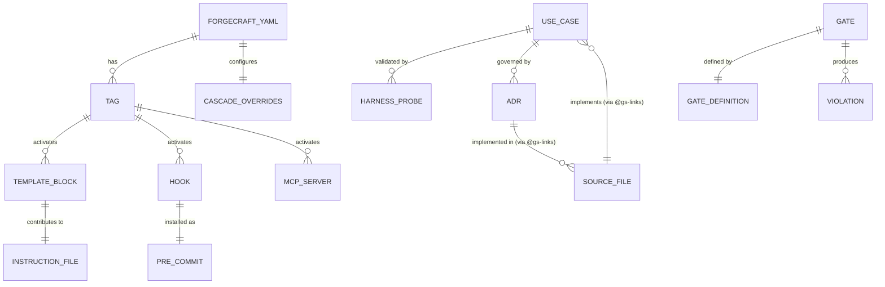

# Architecture: Data Model & Schema

> CNT node — read when: changing forgecraft.yaml schema, modifying template YAML structure, adding a new doc artifact type, or updating the document taxonomy.

## Core Data Structures

### `forgecraft.yaml` — Project Config

The canonical entry point for all ForgeCraft operations. Written by `setup_project` phase 2; read by every tool handler.

```yaml
projectName: string           # Required. Used in generated file headers.
tags: Tag[]                   # Set of active tags. UNIVERSAL always present.
tier: "core"|"recommended"|"optional"   # Content depth. Default: recommended.
outputTargets: Target[]       # Instruction file targets. Default: [claude].
language: "typescript"|"python"         # Primary language. Default: typescript.
compact: boolean              # Trim explanatory tails. Default: false.
exclude: string[]             # Block names to suppress.
variables:
  coverage_minimum: number    # Default: 79
  max_file_length: number     # Default: 400
cascade_overrides:            # Per-step severity and requirement overrides.
  feat.severity: "error"|"warning"
  fix.require_regression_test: boolean
```

### Tag Enum

24 supported tags. Defined in `src/shared/types.ts`:
```
UNIVERSAL | API | WEB-REACT | WEB-NEXT | WEB-STATIC | CLI | LIBRARY |
INFRA | DATA-PIPELINE | ML | MOBILE | ANALYTICS | FINTECH | HEALTHCARE |
WEB3 | REALTIME | STATE-MACHINE | SOCIAL | GAME | HIPAA | SOC2 |
DATA-LINEAGE | OBSERVABILITY-XRAY | MEDALLION-ARCHITECTURE | ZERO-TRUST
```

### Template Block — `instructions.yaml`

```yaml
blocks:
  - name: string              # Unique block identifier (used in exclude lists)
    tier: "core"|"recommended"|"optional"
    tags: Tag[]               # Tags that activate this block
    content: string           # Markdown content injected into instruction file
```

### Template Hook — `hooks.yaml`

```yaml
hooks:
  - name: string              # Hook script filename (without .sh)
    script: string            # Full bash script content
    stack?: string[]          # If set, only install for these stacks
                              # e.g., ["rust"] → only added when Cargo.toml present
```

### Template MCP Server — `mcp-servers.yaml`

```yaml
servers:
  - name: string
    description: string
    command: string           # e.g., "npx"
    args: string[]
    tags: Tag[]               # Tags this server is relevant for
    category: string          # "scaffolding"|"testing"|"ai-ml"|etc.
    env?: Record<string, EnvSpec>
    url?: string
```

### Harness Probe — `.forgecraft/harness/uc-NNN.yaml`

```yaml
uc_id: "UC-NNN"
description: string
probes:
  - type: "file_exists"|"file_contains"|"command_succeeds"|"api_returns"
    target: string
    expected?: string
    command?: string
```

### Gate Definition — `.forgecraft/gates/active/*.yaml`

```yaml
id: string                    # Unique gate ID
name: string
description: string
phase: "development"|"pre-release"|"release-candidate"|"deployment"|"post-deployment"
tags: Tag[]
condition: string             # Shell command that exits 0 = pass
evidence: string              # What to look for as proof of pass
requires_human_review: boolean
generalizable: boolean        # Can this gate be contributed to the registry?
```

## Document Taxonomy (GS Artifacts)

| Artifact | Canonical Path | Written by | Required for cascade |
|---|---|---|---|
| Architectural constitution | `CLAUDE.md` | `sentinel-renderer.ts` | ✅ `constitution` step |
| Document manifest | `docs/manifest.yaml` | `setup-artifact-writers.ts` | ✅ (checked by audit) |
| Session continuity | `docs/status.md` | `setup-artifact-writers.ts` | ✅ (checked by audit) |
| Functional specification | `docs/PRD.md` | stub by artifact writers | ✅ `functional_spec` step |
| Architecture document | `docs/TechSpec.md` | stub by artifact writers | ✅ `functional_spec` step |
| Architecture CNT | `docs/architecture/*.md` | stub by artifact writers | — (checked by audit) |
| Decision records | `docs/adrs/NNNN-*.md` | `change-request.ts` | ✅ `adrs` step |
| Use cases | `docs/use-cases/*.md` | stub by artifact writers | ✅ `behavioral_contracts` step |
| Schemas + ERD | `docs/schema/` | manual / generate_diagram | — (checked by audit) |
| Project config | `forgecraft.yaml` | `setup-project.ts` | ✅ (all steps) |
| Roadmap | `docs/roadmap.md` | `generate-roadmap.ts` | — (optional) |

## Entity Relationships



## DB / State Notes

ForgeCraft has no database. All state is file system:
- **Project state**: `forgecraft.yaml` + `docs/` at the target project root
- **Violation log**: `.forgecraft/gate-violations.jsonl` (append-only JSONL)
- **Harness probes**: `.forgecraft/harness/uc-NNN.yaml`
- **Pending contributions**: `.forgecraft/pending-contributions.jsonl`

ForgeCraft's own source code has no database. Test state is ephemeral (temp dirs in `tests/`).
